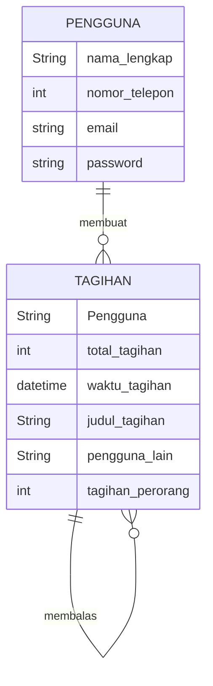
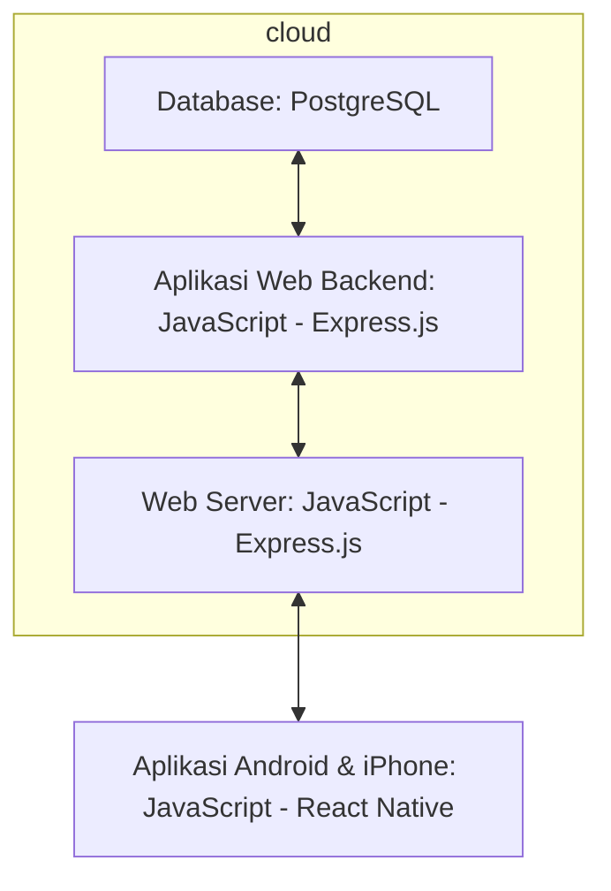

## 1.1 Latar Belakang

Latar belakang pembuatan aplikasi ini berkaitan dengan masalah umum dan hal kecil yang sering dihadapi oleh banyak orang, yaitu pembagian tagihan yang adil dan mudah

## 1.2. Deksripsi Teknologi Informasi

Aplikasi "Split Bill" adalah sebuah alat yang dibuat untuk memudahkan pengguna dalam membagi biaya atau tagihan dengan teman atau keluarga mereka secara adil dan tanpa repot

## 1.3. Branding

Pada tahap ini kita mengeksplorasi branding dari sistem yang dibuat. Branding meliputi:
- Merk: sharebills
- Tagline: membagi tagihan, bukan persahabatan
- Campaign: aplikasi yang membuat penggunanya mudah membagi tagihan mereka, dengan cepat dan adil 

Target user:
- Usia 18+
- Seorang yang ingin membagi tagihan dengan adil dan cepat
- Seorang yang tidak ingin ribet
  
User experience theme:
- Mudah
- Sederhana
- Warna: dominan white and black 

Inspirasi desain:

## 2. User Story

Sebagai | Saya ingin bisa | Sehingga | Prioritas
---|---|---|---
|Pengguna|Membuat pembagian tagihan|Bisa membagi tagihan|⭐⭐⭐⭐⭐
|Pengguna|Menerima pembayaran tagihan dari pengguna lain|Bisa menerima uang|⭐⭐⭐⭐⭐
|Pengguna|Mengirim pembayaran tagihan ke pengguna lain|Bisa mengirim uang|⭐⭐⭐⭐⭐
|Pengguna|Melihat pengguna lain|Memudahkan pengguna mencari tau siapa saja yang ikut berpartisipasi|⭐⭐⭐⭐
|Pengguna|Melihat waktu pembayaran|Membantu mengetahui tenggat pembayaran|⭐⭐⭐⭐⭐

## 3. Struktur Data

- Pada tahap ini, kita sedang mengeksplorasi dan menganalisis struktur data yang dapat mendukung user story yang ada, serta yang mungkin dibutuhkan di masa depan.
- Kita akan merepresentasikan entitas dalam aplikasi dalam bentuk tabel entitas dan atribut

## 4. Arsitektur Sistem

Pada tahap ini kita merancang arsitektur berikut teknologi yang terdapat pada setiap komponen pembentuk aplikasi.

## 5. Teknologi, Library, dan Framework

bla bla bla

## 6. Desain User Experience dan User Interface

Ini adalah UX design yang saya buat dengan menggunakan figma, jika ingin melihat langsung bisa di link berikut:
[figma](https://www.figma.com/file/Qu18CDqYvsBRFQdtxI0rWv/split-bill?type=design&node-id=0%3A1&mode=design&t=VXjV1kk0fPMUqq9J-1)

## 7. Demonstrasi Video

Link youtube nya

## 8. Bagaimana mesin komputasi dan sistem operasi berperan dalam produk teknologi informasimu ?

Link youtube nya di detik jawaban ini

## 9. Bagaimana algoritma, struktur data, dan bahasa pemrograman berperan dalam produk teknologi informasimu ?

Link youtube nya di detik jawaban ini

## 10. Bagaimana metode pengembangan perangkat lunak / Software Development Life Cycle berperan dalam produk teknologi informasimu ?

Link youtube nya di detik jawaban ini

## 11. Bagaimana database / sistem basis data berperan dalam produk teknologi informasimu ?

Link youtube nya di detik jawaban ini

>>>>> untuk sementara teks dulu <<<<<

Database memainkan peran kunci dalam aplikasi split bill, ada beberapa peran utama, yaitu:

•	Penyimpan data transaksi
  informasi transaksi terkait pembayaran dan pembagian tagihan. Informasi ini mencakup detail pembayaran, item atau     layanan yang dibayarkan, dan identitas pengguna yang terlibat dalam transaksi.
  
•	Pengelolaan akun
  digunakan untuk menyimpan profil pengguna, informasi akun, dan preferensi pengguna. Ini membantu dalam mengelola      identitas pengguna, memungkinkan mereka untuk masuk, mengatur preferensi pembayaran, dan mengakses riwayat            transaksi   mereka.
  
•	Riwayat transaksi 
  Basis data menyimpan riwayat transaksi, memungkinkan pengguna untuk melihat riwayat pembayaran mereka. Hal ini        bermanfaat untuk melacak pengeluaran, meninjau pembayaran masa lalu, dan memantau aktivitas keuangan pribadi

