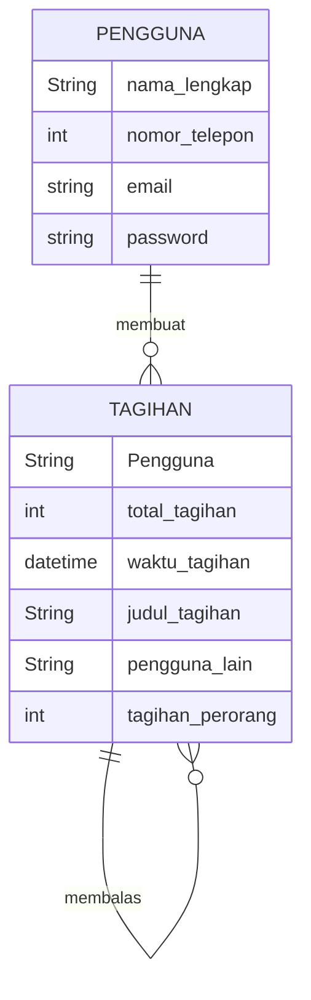
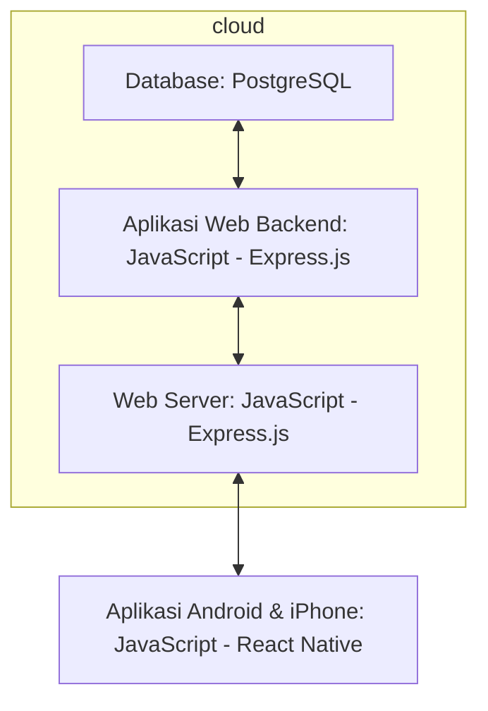

## 1.1 Latar Belakang

Latar belakang pembuatan aplikasi ini berkaitan dengan masalah umum dan hal kecil yang sering dihadapi oleh banyak orang, yaitu pembagian tagihan yang adil dan mudah 

Dengan adanya aplikasi sharebills, pengguna dapat membagi pengeluaran dengan mudah dan menghindari kesalahpahaman atau konflik terkait pembagian pengeluaran. Aplikasi ini sangat berguna saat bepergian bersama teman atau keluarga dan dapat membantu menghemat waktu dan usaha dalam menghitung pembagian pengeluaran. Cukup gunakan aplikasi ini tanpa ribet dan mudah untuk digunakan

## 1.2. Deksripsi Teknologi Informasi

Aplikasi "sharebills" adalah sebuah alat atau aplikasi yang dibuat untuk memudahkan pengguna dalam membagi biaya atau tagihan dengan teman atau keluarga secara adil dan tanpa ribet. UI/UX aplikasi ini dibuat dengan bantuan Figma dan beberapa referensi yang saya ambil di web dribbble, rencananya aplikasi akan dibuat dengan bantuan react native, untuk database rencana akan memakai postgresql

## 1.3. Branding

Pada tahap ini kita mengeksplorasi branding dari sistem yang dibuat. Branding meliputi:
- Merk: sharebills
- Tagline: membagi tagihan, bukan persahabatan
- Campaign: aplikasi yang membuat penggunanya mudah membagi tagihan mereka, dengan cepat dan adil 

Target user:
- Usia 18+ (usia dibawah itu perlu pendampingan)
- Seorang yang ingin membagi tagihan dengan adil dan cepat
- Seorang yang tidak ingin ribet
  
User experience theme:
- Mudah
- Sederhana
- Warna: dominan white and black 

Inspirasi desain:

## 2. User Story

Sebagai | Saya ingin bisa | Sehingga | Prioritas
---|---|---|---
|Pengguna|Membuat pembagian tagihan|Bisa membagi tagihan|⭐⭐⭐⭐⭐
|Pengguna|Menerima pembayaran tagihan dari pengguna lain|Bisa menerima uang|⭐⭐⭐⭐⭐
|Pengguna|Mengirim pembayaran tagihan ke pengguna lain|Bisa mengirim uang|⭐⭐⭐⭐⭐
|Pengguna|Melihat pengguna lain|Memudahkan pengguna mencari tau siapa saja yang ikut berpartisipasi|⭐⭐⭐⭐
|Pengguna|Melihat waktu pembayaran|Membantu mengetahui tenggat pembayaran|⭐⭐⭐⭐⭐
|Pengguna|Menyimpan kontak user lain|Memudahkan menambahkan user lain ke list tagihan|⭐⭐⭐
|Pengguna|Mengirim notif tagihan|Memudahkan mengingat pembayaran|⭐⭐
|Pengguna|Melihat riwayat pembayaran|Memudahkan melacak pembayaran|⭐⭐
|Pengguna|Chatingan dengan user lain|Memudahkan komunikasi|⭐

## 3. Struktur Data

- Pada tahap ini, kita sedang mengeksplorasi dan menganalisis struktur data yang dapat mendukung user story yang ada, serta yang mungkin dibutuhkan di masa depan.
- Kita akan merepresentasikan entitas dalam aplikasi dalam bentuk tabel entitas dan atribut

## 4. Arsitektur Sistem

Pada tahap ini kita merancang arsitektur berikut teknologi yang terdapat pada setiap komponen pembentuk aplikasi.

## 5. Teknologi, Library, dan Framework

1. Bahasa Pemrograman:
- Java dan javascript

2. Platform Mobile:
- Android Studio

3. Framework Aplikasi:
- React Native

4. Database:
- PostgreSQL

5. UI/UX Design:
- Figma

## 6. Desain User Experience dan User Interface

Ini adalah UX design yang saya buat dengan menggunakan figma, jika ingin melihat langsung bisa di link berikut:
[figma](https://www.figma.com/file/Qu18CDqYvsBRFQdtxI0rWv/split-bill?type=design&node-id=0%3A1&mode=design&t=VXjV1kk0fPMUqq9J-1)

## 7. Demonstrasi Video

Link youtube nya

## 8. Bagaimana mesin komputasi dan sistem operasi berperan dalam produk teknologi informasimu ?

Link youtube nya di detik jawaban ini

>>>> untuk sementara teks dulu <<<<

Mesin komputasi dan sistem operasi memiliki peran penting dalam pengoperasian aplikasi split bill. Berikut ini kontribusinya:

1. Mesin Komputasi: Mesin komputasi, atau hardware komputer, adalah fondasi fisik tempat aplikasi berjalan. Ini mencakup komponen seperti prosesor, memori, dan penyimpanan, yang semuanya mempengaruhi kinerja aplikasi. Misalnya, prosesor yang cepat dapat mempercepat perhitungan pembagian tagihan, sementara memori yang cukup dapat memungkinkan aplikasi untuk menangani sejumlah besar data pengguna.

2. Sistem Operasi: Sistem operasi mengelola sumber daya hardware dan menyediakan layanan yang diperlukan oleh aplikasi. Dalam konteks aplikasi split bill, sistem operasi dapat:
   - Mengelola koneksi jaringan yang digunakan aplikasi untuk berkomunikasi dengan server dan pengguna lain.
   - Menyediakan interface untuk aplikasi untuk menyimpan data ke disk atau mengambil data dari disk.
   - Mengelola memori yang digunakan oleh aplikasi.
   - Menyediakan mekanisme keamanan untuk melindungi data pengguna dan mencegah akses yang illegal.

Dengan demikian, mesin komputasi dan sistem operasi memainkan peran penting dalam memastikan bahwa aplikasi split bill dapat berjalan dengan lancar dan efisien.

## 9. Bagaimana algoritma, struktur data, dan bahasa pemrograman berperan dalam produk teknologi informasimu ?

Link youtube nya di detik jawaban ini

>>>> untuk sementara teks dulu <<<<

Algoritma, struktur data, dan bahasa pemrograman semuanya memainkan peran penting dalam pengembangan aplikasi split bill. Berikut adalah bagaimana mereka berkontribusi:

1. Algoritma: Dalam konteks aplikasi split bill, algoritma dapat digunakan untuk menghitung bagaimana tagihan harus dibagi di antara pengguna, memproses pembayaran, dan melakukan operasi lainnya.
   - Pertama membuka aplikasi, pengguna akan dibawa ke page "tampilan awal" dan akan diberikan pilihan "Login" atau "Register"
   - Jika user memilih "Login", maka user akan dibawa ke page "Login" untuk memasukkan email dan password yang sudah dibuat sebelumnnya
   - Jika user memilih "Register", makas user akan dibawa ke page "Register" untuk membuat akun baru
   - Setelah mengisi page "Login" atau "Register" user akan dibawa ke page "Main page", di sana user bisa membuat tagihan, melihat tagihan yang ada dan melihat akunnya sendiri
   - Jika user mengklik icon account di pojok kanan atas di page "Main page", maka user akan dibawa ke page "account" di sana user bisa melihat profile akuunya sendiri dan mengedit akunnya sendiri
   - Jika user mengklik salah satu bentuk tagihan di page "Main page", maka user akan dibawa ke page "Android Small - 2"
   - di page "Android Small - 2" user bisa melihat dan membayar tagihan

3. **Struktur Data**: Struktur data digunakan untuk menyimpan dan mengatur data dalam aplikasi. Misalnya, aplikasi split bill mungkin menggunakan struktur data seperti array atau list untuk menyimpan daftar pengguna, atau pohon atau graf untuk merepresentasikan jaringan sosial pengguna.

4. **Bahasa Pemrograman**: Bahasa pemrograman digunakan untuk menulis kode yang mengimplementasikan algoritma dan struktur data. Pilihan bahasa pemrograman dapat mempengaruhi kinerja aplikasi, kemudahan pengembangan, dan faktor lainnya. Misalnya, Java atau Python mungkin digunakan untuk backend aplikasi, sementara JavaScript mungkin digunakan untuk frontend.

Dengan menggunakan algoritma yang efisien, struktur data yang tepat, dan bahasa pemrograman yang sesuai, tim pengembangan dapat memastikan bahwa aplikasi split bill berfungsi dengan baik dan memberikan pengalaman pengguna yang baik.

## 10. Bagaimana metode pengembangan perangkat lunak / Software Development Life Cycle berperan dalam produk teknologi informasimu ?

Link youtube nya di detik jawaban ini

>>>> untuk sementara teks dulu <<<<

Metode pengembangan perangkat lunak, juga dikenal sebagai Siklus Hidup Pengembangan Perangkat Lunak (SDLC), memiliki peran krusial dalam proses pembuatan aplikasi split bill. Berikut adalah bagaimana SDLC berkontribusi dalam setiap tahap pengembangan:

1. **Perencanaan**: Tahap ini melibatkan penetapan tujuan dan sasaran untuk aplikasi split bill, termasuk penentuan anggaran dan jadwal pengembangan.

2. **Analisis Kebutuhan**: Di tahap ini, tim mengumpulkan dan menganalisis persyaratan aplikasi, seperti fungsi yang dibutuhkan, desain, dan kebutuhan keamanan.

3. **Desain**: Tahap ini melibatkan pembuatan desain arsitektur sistem dan antarmuka pengguna untuk aplikasi.

4. **Pengembangan**: Di tahap ini, tim mulai membangun aplikasi berdasarkan desain dan persyaratan yang telah ditentukan.

5. **Pengujian**: Aplikasi diuji untuk memastikan tidak ada kesalahan atau masalah lainnya. Ini mencakup pengujian fungsionalitas, keamanan, dan kinerja aplikasi.

6. **Pengiriman**: Setelah aplikasi telah diuji dan disetujui, aplikasi diluncurkan untuk digunakan oleh publik.

7. **Pemeliharaan**: Setelah peluncuran, tim terus memantau aplikasi dan melakukan pembaruan atau perbaikan yang diperlukan.

8. **Dokumentasi**: SDLC menekankan pentingnya dokumentasi yang baik selama seluruh proses pengembangan. Dokumentasi ini berguna untuk tim pengembangan, administrator sistem, dan pengguna akhir.

9. **Manajemen Proyek**: SDLC juga mencakup aspek manajemen proyek yang baik, termasuk perencanaan, pemantauan, dan pelaporan kemajuan proyek.

Dengan menggunakan SDLC, tim dapat memastikan bahwa aplikasi split bill dikembangkan dengan cara yang sistematis dan efisien, menghasilkan produk berkualitas tinggi yang memenuhi kebutuhan pengguna.

## 11. Bagaimana database / sistem basis data berperan dalam produk teknologi informasimu ?

Link youtube nya di detik jawaban ini

>>>>> untuk sementara teks dulu <<<<<

Database memainkan peran kunci dalam aplikasi split bill, ada beberapa peran utama, yaitu:

•	Penyimpan data transaksi
  informasi transaksi terkait pembayaran dan pembagian tagihan. Informasi ini mencakup detail pembayaran, item atau     layanan yang dibayarkan, dan identitas pengguna yang terlibat dalam transaksi.
  
•	Pengelolaan akun
  digunakan untuk menyimpan profil pengguna, informasi akun, dan preferensi pengguna. Ini membantu dalam mengelola      identitas pengguna, memungkinkan mereka untuk masuk, mengatur preferensi pembayaran, dan mengakses riwayat            transaksi   mereka.
  
•	Riwayat transaksi 
  Basis data menyimpan riwayat transaksi, memungkinkan pengguna untuk melihat riwayat pembayaran mereka. Hal ini        bermanfaat untuk melacak pengeluaran, meninjau pembayaran masa lalu, dan memantau aktivitas keuangan pribadi

